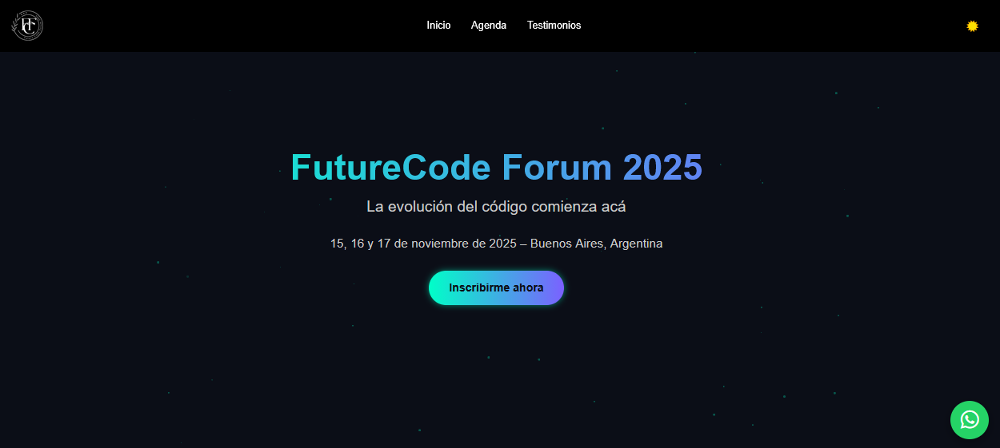

# 💻 FutureCode Forum 2025 – 3ª Edición

**FutureCode Forum 2025** es una **landing page ficticia de un evento tecnológico internacional**, creada con **HTML, CSS y JavaScript puro**.  
El objetivo del proyecto es ofrecer una experiencia web inmersiva e interactiva para **demostrar habilidades avanzadas en desarrollo frontend, diseño responsive y experiencia de usuario.**

## 🌐 Demo

## 🚀 Descripción

**FutureCode Forum** representa un evento futurista donde se reúnen **desarrolladores, diseñadores y líderes tecnológicos** para compartir ideas, aprender y conectar.  
La web fue diseñada para transmitir innovación y modernidad, con secciones animadas, contadores dinámicos, galería interactiva, testimonios y formularios funcionales.

## 🖼️ Captura de Pantalla

## ✨ Características principales

* ⚙️ **Pantalla de carga animada** con simulación de inicialización de sistema.  
* 🧠 **Contadores interactivos** que muestran estadísticas del evento.  
* 🗓️ **Línea de tiempo dinámica** con los 3 días de la agenda.  
* 👨‍💻 **Sección de oradores destacados** con biografía e imagen.  
* 💬 **Slider de testimonios** con navegación lateral.  
* 🖼️ **Galería interactiva** con botones de “Me gusta” y compartir.  
* 📩 **Formulario de inscripción** validado con JavaScript.  
* 💌 **Newsletter** para suscribirse a novedades del evento.  
* 🌓 **Modo oscuro y claro** con alternancia instantánea.  
* 📱 **Diseño 100% responsive**, adaptable a móviles, tablets y desktop.  
* 🔝 **Botón de volver arriba** y notificaciones dinámicas.  
* 💬 **Botón flotante de WhatsApp** para contacto directo.  

## 📂 Estructura del proyecto

### │── index.html  
### │── css  
####      └── styles.css  
### │── js  
####      └── script.js  
### │── assets  
####      ├── imágenes de galería y oradores  
####      └── íconos de redes sociales y logo 
### │── preview.png  
### └── README.md  

## 🛠️ Tecnologías utilizadas

* **HTML5** → Estructura semántica y accesible del sitio.  
* **CSS3** → Estilos avanzados, animaciones, diseño responsive y modo oscuro.  
* **JavaScript (ES6)** → Interacciones dinámicas, sliders, contadores y modales.  
* **Font Awesome** → Íconos para redes sociales y elementos visuales.  

## ⚡ Funcionalidades JavaScript destacadas

* Contadores automáticos con animación progresiva.  
* Sistema de carga con barra de progreso animada.  
* Slider de testimonios con botones de navegación.  
* Modal para ver imágenes de la galería en grande.  
* Alternancia de tema (oscuro/claro) con persistencia visual.  
* Sistema de notificaciones emergentes.  

## 👨‍💻 Desarrollador

Proyecto desarrollado por **Thomas Ramírez**, Desarrollador Web Frontend especializado en **Landing Pages Profesionales**.  
Creado como proyecto demostrativo para su portafolio, mostrando habilidades en diseño interactivo y desarrollo web moderno.

## 🌎 Redes sociales

[LinkedIn](https://www.linkedin.com/in/thomas-alan-ramirez/) | [Fiverr](https://es.fiverr.com/aramirezthomas?public_mode=true) | [Facebook](https://www.facebook.com/profile.php?id=61575025664166) | [Reddit](https://www.reddit.com/user/Late-Put-9295/)

## 💼 Disponible para contratación

¿Querés una **landing page profesional e interactiva** como esta para tu evento o negocio?  
Podés encargarla en mi perfil de **Fiverr por solo $10 USD**.  
👉 [Visitar mi Fiverr](https://es.fiverr.com/s/1qv4kdp)

## ⚠️ Aviso Legal

> Este sitio es un **proyecto ficticio sin fines comerciales**.  
> Las fechas, nombres, empresas y testimonios son de carácter demostrativo.

## 📝 Licencia

Este proyecto está bajo la **MIT License**.  
Libre para usar, modificar y compartir.

## ⭐ ¿Te gustó el proyecto?

Si te gustó **FutureCode Forum 2025**, ¡dejá una ⭐ en GitHub y compartilo!  
Inspirate, adaptalo y usalo para tus propios proyectos web.

# 🔮 ¡Gracias por visitar **FutureCode Forum 2025**! 🚀💡